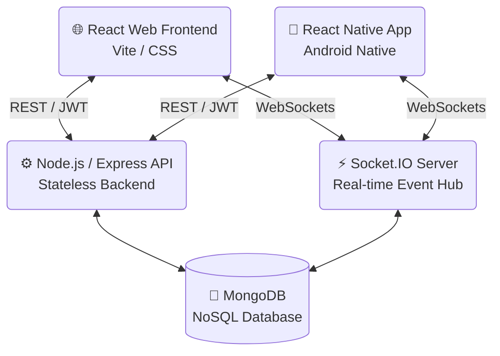

<div align="center">
  

  <h1>Kyro Social</h1>
  
  <p>
    <strong>A next-generation, premium social networking ecosystem built for scale, speed, and cross-platform accessibility.</strong>
  </p>

  <p>
    <a href="https://kyro-social.vercel.app/"><strong>💻 Live Web Application</strong></a> ·
    <a href="#"><strong>📱 Google Play Store</strong></a>
  </p>
  
  <p>
    
    
    
    
  </p>
</div>

<hr />

## 🌟 Overview

Kyro Social is a full-stack, monorepo-architected social media platform designed from the ground up to deliver a flagship user experience. It provides identical feature parity across its responsive Web browser experience and its natively compiled Android application.

From real-time chat infrastructure to optimistic UI updates in the news feed, Kyro Social leverages modern architecture to ensure zero-latency interactions and a fluid aesthetic.

---

## 🏛️ System Architecture

Kyro Social utilizes a decoupled, API-first architecture, allowing multiple customized client interfaces (Web & Mobile) to consume a single, synchronized source of truth.



---

## ✨ Features Matrix

| Feature | Web App (Vite/React) | Mobile App (React Native) |
| :--- | :---: | :---: |
| **Secure Authentication** | ✅ JWT (HTTP-Only) | ✅ JWT (AsyncStorage) |
| **News Feed & Infinite Scroll** | ✅ | ✅ |
| **Real-time Live Chat** | ✅ | ✅ |
| **Push / In-App Notifications** | ✅ | ✅ |
| **Post Creation & Image Uploads** | ✅ | ✅ native picker |
| **Dark Mode / Theming** | ✅ | ✅ |
| **Profile Management** | ✅ | ✅ |
| **Save / Bookmark Posts** | ✅ | ✅ |

---

## 🛠 Tech Stack Details

### 1. The Backend Core (`/backend`)
* **Runtime**: Node.js
* **Framework**: Express.js
* **Database**: MongoDB (via Mongoose ORM)
* **Real-time Engine**: Socket.IO (Bidirectional Event-Based Comms)
* **Security**: bcryptjs (Hashing), JSON Web Tokens (JWT) for stateless auth, cors, helmet.

### 2. The Web Frontend (`/web-frontend`)
* **Framework**: React.js 19
* **Build Tooling**: Vite (for ultra-fast HMR and optimized production bundles)
* **Styling**: Modern Vanilla CSS methodologies (Glassmorphism, CSS Variables for Theming).
* **Routing**: React Router DOM (v6)

### 3. The Mobile Application (`/mobile-app`)
* **Framework**: React Native CLI (v0.79.1)
* **Navigation**: React Navigation v7 (Stack, BottomTabs, Drawer)
* **Native Linking**: Fully configured `android/` directory for Android Studio builds.
* **Storage**: `@react-native-async-storage/async-storage` for local token persistence.
* **Animations**: `react-native-reanimated` & `lottie-react-native`.

---

## 📂 Repository Structure

```text
Kyro-Social/
├── backend/                  # Node.js API & Socket server
│   ├── controllers/          # Business logic handlers
│   ├── models/               # MongoDB Mongoose schemas
│   ├── routes/               # API endpoint definitions
│   └── server.js             # API entry point
├── mobile-app/               # React Native Android application
│   ├── android/              # Native Android Java/C++ source code
│   ├── src/                  # React Native JS source
│   │   ├── components/       # Reusable mobile UI elements
│   │   ├── navigation/       # Stack/Tab iterators
│   │   └── screens/          # Mobile view files
│   └── App.js                # Mobile entry point
└── web-frontend/             # React Vite web application
    ├── src/
    │   ├── components/       # Reusable web UI elements
    │   ├── pages/            # Web route views
    │   ├── theme/            # Global CSS and Design Tokens
    │   └── assets/           # Platform logos and images
    └── vite.config.js        # Web build configurations
```

---

## 🚀 Getting Started Guide

Follow these instructions to set up the entire platform on your local machine.

### Prerequisites
Before you begin, ensure you have the following installed:
* **Node.js** (v18 or higher)
* **MongoDB** (Local instance or MongoDB Atlas URI)
* **Android Studio** (For compiling the mobile app natively)
* **Git**

### Step 1: Clone & Configure Backend

```bash
# 1. Clone the repository
git clone <repository-url>
cd Kyro-Social

# 2. Enter the backend directory
cd backend

# 3. Install dependencies
npm install

# 4. Configure Environment Variables
# Create a .env file locally with the following keys:
# PORT=5000
# MONGO_URI=your_mongodb_connection_string
# JWT_SECRET=your_super_secret_key

# 5. Start the API
npm run dev
```
> **Success Check:** You should see `Server is running on port 5000` in your terminal.

### Step 2: Configure Web Frontend

Open a new terminal window:
```bash
# 1. Enter the web-frontend directory
cd web-frontend

# 2. Install dependencies
npm install

# 3. Start the Vite development server
npm run dev
```
> **Success Check:** Navigate to `http://localhost:5173` in your browser. The web application should be visible.

### Step 3: Configure Mobile App (Android)

Open a third terminal window:
```bash
# 1. Enter the mobile app directory
cd mobile-app

# 2. Install Javascript dependencies
npm install

# 3. Start the Metro Bundler (React Native Server)
npx react-native start --reset-cache

# 4. Open a fourth terminal window, bridge the port, and build the app
# (Ensure your physical Android device is connected via USB, or open an Emulator)
cd mobile-app
npx react-native run-android
```

> **Note for Mobile API Connections:** If testing on a physical device, ensure the `baseURL` in `mobile-app/src/api/axios.js` points to your computer's local IP address (e.g., `http://192.168.1.XX:5000/api`) rather than `localhost`.

---

## 📸 Platform Screenshots

> *(Repository maintainers: Insert your application snapshots below by updating the image references)*

<table align="center">
  <tr>
    <td align="center"><strong>Mobile News Feed</strong></td>
    <td align="center"><strong>Desktop Dashboard</strong></td>
  </tr>
  <tr>
    <td></td>
    <td></td>
  </tr>
</table>

---

## 📜 License

This project is proprietary and confidential. Unauthorized copying of these files, via any medium, is strictly prohibited. 
